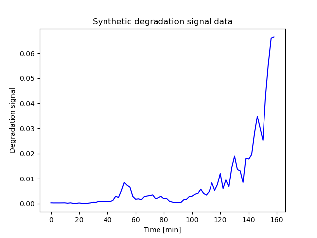
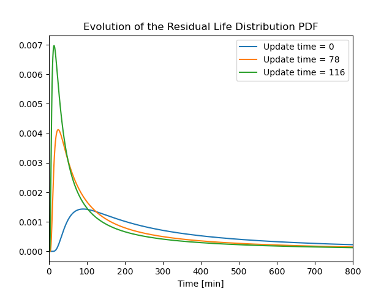

# pyrld

Python implementation of a prognostic algorithm based on Bayesian updating under the assumption of a degradation signal with an increasing exponential form. The form of the degradation model and the prognostic algorithm are taken from Gebraeel et al. [1] and implemented into the `BayesRLD` class. 

### Dependencies

- `numpy`, `matplotlib`, `scipy`

### Basic usage
A reference example is given in `./tests/main.py` using input parameters taken and/or computed from Gebraeel's work [1] [2]. An Excel spreadsheet, `./tests/data.xlsx`, computes some of the input parameters from the data collected by Gebraeel in his PhD thesis [2].

First start by importing the `BayesRLD` class:
```Python
# import os
# import sys
# fpath = os.path.join(os.pardir, "")
# sys.path.append(fpath)

from pyrld import BayesRLD
```

Define the input parameters. (Their meaning is given in `./tests/main.py`.)
```Python
phi = 0
sig = np.sqrt(0.07721)
mu0 = -7.6764738
sig0 = 0.56172343
mu1 = 0.046585 
sig1 = 0.0071362
D = 0.03
dt = 2
interval = 3000
```

Instantiate the `BayesRLD` class:
```Python
rld = BayesRLD(phi, mu0, sig0, mu1, sig1, sig, D)
```

If need be, generate synthetic degradation data. (For testing purposes or illustration purposes. Skip this step if you do have real data that can be properly modeled as an increasing exponential.):
```Python
time, signal, actual_fail_time, fig = rld.synthetic_data(dt)
```

An example synthetic signal generated by `synthetic_data` is given in the figure below.

<p align="center">
  
</p>

"Push" signal observations into the `BayesRLD` object. This will automatically update the Residual Life Distribution under the hood.
```Python
rld.push(timestamp, observation) 
```

If need be, plot Cumulative Distribution Function (CDF) and Probability Density Function (PDF) of the Residual Life Distribution (RLD):
```Python
rld.plot_cdf(interval)
rld.plot_pdf(interval)
```

One can also display multiple RLD PDFs on the same figure via:
```Python
rld.multi_pdf_plot()
```
The figure below is an example output from `multi_pdf_plot`.

<p align="center">
  
</p>

Percentiles can also be computed. For example, the line of code below computes the 90th percentile of the RLD, meaning that the device has 90% chance of failing before `t_90`.
```Python
t_90 = rld.percentile(p=0.9) 
```


### References
[1] Gebraeel, N., Lawley, M. A., Li. R., and Ryan J. K., "Residual-life distributions from component degradation signals: a Bayesian approach," IIE Transactions (2005) 37, 543-557

[2] Gebraeel, N., "Real-time degradation modeling and residual life prediction for component maintenance and replacement," PhD Thesis (2003)